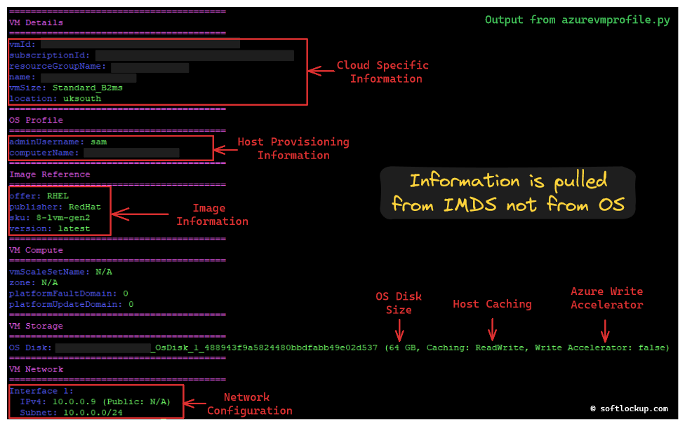

# Profile Fetcher for Linux Azure VM

**GitHub Repository:** [https://github.com/samatild/azvmprofilefetcher](https://github.com/samatild/azvmprofilefetcher)

## Introduction

Managing Azure Virtual Machines (VMs) can be complex, especially when dealing with multiple instances and ensuring they are configured correctly. The Profile Fetcher for Azure VM is a script designed to simplify the process of retrieving and displaying detailed metadata about your Azure VMs. This article explains how to use the script and how it can make the task of checking Azure VM profiles easier.

## Features

- **Fetch Metadata:** Retrieves metadata directly from the Azure Instance Metadata Service.
- **Simple Summary:** Organizes and displays metadata in a structured format with clear section headers.

## Requirements

- **Python 3:** The script is written in Python 3 and requires Python to be installed on the system.

## How to Use

To use the Profile Fetcher for Azure VM, you need to run the script on your Azure VM. The easiest way to execute the script is by using `curl` to download and pipe it directly to `python3`. Here is the command:

```bash
curl -s https://raw.githubusercontent.com/samatild/azvmprofilefetcher/main/azurevmprofile.py | python3
```

This command downloads the script from the GitHub repository and runs it using Python 3. The script will then fetch the metadata from the Azure Instance Metadata Service and display it in a structured format.

### Example Output

[](images/azurevmprofile_output.png)

## Conclusion
The Profile Fetcher for Azure VM script provides a straightforward and effective way to retrieve and display detailed information about your Azure VMs. By using this script, administrators and developers can quickly access important VM metadata, making it easier to manage and troubleshoot their Azure environments.

For more details and to access the script, visit the  [**GitHub Repository:**](https://github.com/samatild/azvmprofilefetcher).