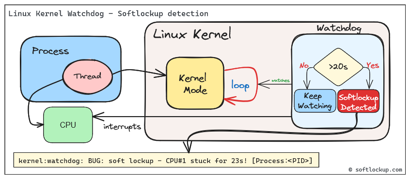
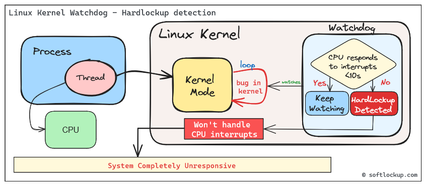
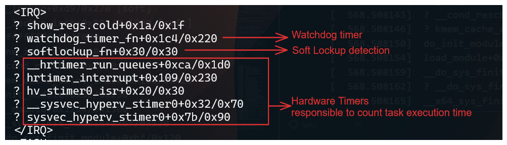
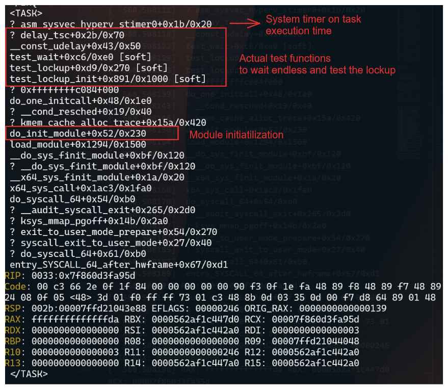

# Introduction
## Kernel Watchdog

According to [Linux Kernel Documentation](https://www.kernel.org/doc/html/latest/admin-guide/lockup-watchdogs.html), the Linux kernel can act as a watchdog to detect both soft and hard lockups.

The Linux Kernel Watchdog is a mechanism that monitors the system for both soft and hard lockups. It is designed to detect when a CPU is stuck in a loop and unable to make progress. When a soft lockup is detected, the watchdog will print a warning message to the system log.

## Soft vs. Hard Lockups

### Soft Lockup

A ‘softlockup’ is defined as a bug that causes the kernel to loop in kernel mode for more than 20 seconds, without giving other tasks a chance to run. The current stack trace is displayed upon detection and, by default, the system will stay locked up.



By default the system will display the stack trace and stay locked up. Watchdog can be configured to reboot the system automatically when a soft lockup is detected. This can be done by setting the `softlockup_panic` parameter to a value greater than zero.

Common error messages:

```bash
BUG: soft lockup - CPU#0 stuck for 22s! [swapper/0:1]
Modules linked in: ...
```

### Hard Lockup

A ‘hardlockup’ is defined as a bug that causes the CPU to loop in kernel mode for more than 10 seconds, without letting other interrupts have a chance to run.



Similar to softlockup, the system will display the stack trace and stay locked up. The watchdog can be configured to reboot the system automatically when a hard lockup is detected. This can be done by setting the `hardlockup_panic` parameter to a value greater than zero.

Common error messages:

```bash
BUG: hard lockup - CPU#0 stuck for 22s! [swapper/0:1]
Modules linked in: ...
```
---

# Deep Dive into Soft/Hard Lockups

## Reacting to soft/hard lockups

Ok, so you have a soft or hard lockup, what now? Here are some steps you can take to troubleshoot and resolve the issue:

### The Basics
**1. Check the system logs:** Look for any error messages or warnings that may indicate the cause of the lockup.

**2. Check the CPU load:** High CPU load can cause lockups. Use tools like `top` or `htop` to monitor CPU usage.

**3. Read the watchdog warning message:** The watchdog will print a warning message to the system log when a lockup is detected. This message may provide clues as to the cause of the lockup. Usually, the message will include a stack trace that shows where the CPU is stuck, also the name of the process that caused the lockup and it's PID.

### Advanced Troubleshooting

The watchdog can be configured to panic the system when a lockup is detected. This can be done by setting the `softlockup_panic` or  `hardlockup_panic` parameters to a value greater than zero.:

```bash
# Enable panic on soft lockup
echo 1 > /proc/sys/kernel/softlockup_panic

# Enable panic on hard lockup
echo 1 > /proc/sys/kernel/hardlockup_panic
```
In combination with crash dump, you can get a full dump of the system state when a lockup is detected. This can be useful for debugging the issue.

Step-by-step guide for this recipe:
**1.** Enable crash dump in the kernel configuration. Make sure that it's collecting memory dumps when a kernel panic occurs.
**2.** Configure the kernel to reboot the system when a lockup is detected.
**3.** Proceed by analyzing the crash dump to identify the cause of the lockup.

# Demo - Creating a Softlockup and understanding the watchdog output

## Simulating a Soft Lockup
For the example below, we will simulate a soft lockup by loading a kernel module design to test if watchdog and lockup detection are working as expected.

Test module to generate lockups: [CONFIG_TEST_LOCKUP](https://www.kernelconfig.io/config_test_lockup)

> Note: When installing Linux Kernel modules, make sure: You are using the correct version of the kernel module for your kernel version. (Browse kernel config source code and match your kernel version: [Example for v6.9.5](https://git.kernel.org/pub/scm/linux/kernel/git/stable/linux.git/tree/lib/test_lockup.c?h=v6.9.5)). And, that you have the necessary kernel headers installed.

The following parameters are available to simulate a variety of lockups:
```bash

# modinfo soft.ko
filename:       /root/CONFIG_TEST_LOCKUP/soft.ko
description:    Test module to generate lockups
author:         Konstantin Khlebnikov <khlebnikov@yandex-team.ru>
license:        GPL
srcversion:     302B4AE69F898F7B25CABF8
depends:
retpoline:      Y
name:           soft
vermagic:       5.15.0-1064-azure SMP mod_unload modversions
parm:           time_secs:lockup time in seconds, default 0 (uint)
parm:           time_nsecs:nanoseconds part of lockup time, default 0 (uint)
parm:           cooldown_secs:cooldown time between iterations in seconds, default 0 (uint)
parm:           cooldown_nsecs:nanoseconds part of cooldown, default 0 (uint)
parm:           iterations:lockup iterations, default 1 (uint)
parm:           all_cpus:trigger lockup at all cpus at once (bool)
parm:           state:wait in 'R' running (default), 'D' uninterruptible, 'K' killable, 'S' interruptible state (charp)
parm:           use_hrtimer:use high-resolution timer for sleeping (bool)
parm:           iowait:account sleep time as iowait (bool)
parm:           lock_read:lock read-write locks for read (bool)
parm:           lock_single:acquire locks only at one cpu (bool)
parm:           reacquire_locks:release and reacquire locks/irq/preempt between iterations (bool)
parm:           touch_softlockup:touch soft-lockup watchdog between iterations (bool)
parm:           touch_hardlockup:touch hard-lockup watchdog between iterations (bool)
parm:           call_cond_resched:call cond_resched() between iterations (bool)
parm:           measure_lock_wait:measure lock wait time (bool)
parm:           lock_wait_threshold:print lock wait time longer than this in nanoseconds, default off (ulong)
parm:           disable_irq:disable interrupts: generate hard-lockups (bool)
parm:           disable_softirq:disable bottom-half irq handlers (bool)
parm:           disable_preempt:disable preemption: generate soft-lockups (bool)
parm:           lock_rcu:grab rcu_read_lock: generate rcu stalls (bool)
parm:           lock_mmap_sem:lock mm->mmap_lock: block procfs interfaces (bool)
parm:           lock_rwsem_ptr:lock rw_semaphore at address (ulong)
parm:           lock_mutex_ptr:lock mutex at address (ulong)
parm:           lock_spinlock_ptr:lock spinlock at address (ulong)
parm:           lock_rwlock_ptr:lock rwlock at address (ulong)
parm:           alloc_pages_nr:allocate and free pages under locks (uint)
parm:           alloc_pages_order:page order to allocate (uint)
parm:           alloc_pages_gfp:allocate pages with this gfp_mask, default GFP_KERNEL (uint)
parm:           alloc_pages_atomic:allocate pages with GFP_ATOMIC (bool)
parm:           reallocate_pages:free and allocate pages between iterations (bool)
parm:           file_path:file path to test (string)
parm:           lock_inode:lock file -> inode -> i_rwsem (bool)
parm:           lock_mapping:lock file -> mapping -> i_mmap_rwsem (bool)
parm:           lock_sb_umount:lock file -> sb -> s_umount (bool)

```

We will simulate a soft lockup by loading the module with the following parameters:
```bash
insmod soft.ko time_secs=35 iterations=1 all_cpus=0 state="R"
```

Where:
- `time_secs=35` - Lockup time in seconds
- `iterations=1` - Lockup iterations
- `all_cpus=0` - Trigger lockup at all CPUs at once
- `state="R"` - Wait in 'R' running state

After loading the module, the system will be locked up for 35 seconds. The watchdog will detect the soft lockup and print a warning message to the system log.

## Understanding the watchdog output

### The watchdog warning message
    
```bash
[  568.503455] watchdog: BUG: soft lockup - CPU#1 stuck for 26s! [insmod:5912]
[  568.508018] Modules linked in: soft(OE+) nls_iso8859_1 kvm_intel kvm crct10dif_pclmul crc32_pclmul ghash_clmulni_intel binfmt_misc sha256_ssse3 sha1_ssse3 aesni_intel crypto_simd cryptd joydev hid_generic serio_raw hyperv_drm drm_kms_helper syscopyarea hid_hyperv sysfillrect sysimgblt hid fb_sys_fops hv_netvsc hyperv_keyboard cec rc_core sch_fq_codel drm i2c_core efi_pstore ip_tables x_tables autofs4
```

The watchdog warning message includes the following information:
- `BUG: soft lockup` - Indicates that a soft lockup was detected
- `CPU#1 stuck for 26s!` - Indicates that CPU#1 was stuck for 26 seconds
- `[insmod:5912]` - Indicates that the process with PID 5912 caused the lockup (in this case, the `insmod` process)
- `Modules linked in (...)` - Lists the kernel modules that were loaded at the time of the lockup

### The stack trace

```bash
[  568.508074] Call Trace:
[  568.508075]  <IRQ>
[  568.508079]  ? show_regs.cold+0x1a/0x1f
[  568.508085]  ? watchdog_timer_fn+0x1c4/0x220
[  568.508089]  ? softlockup_fn+0x30/0x30
[  568.508092]  ? __hrtimer_run_queues+0xca/0x1d0
[  568.508095]  ? hrtimer_interrupt+0x109/0x230
[  568.508097]  ? hv_stimer0_isr+0x20/0x30
[  568.508101]  ? __sysvec_hyperv_stimer0+0x32/0x70
[  568.508104]  ? sysvec_hyperv_stimer0+0x7b/0x90
[  568.508109]  </IRQ>
[  568.508110]  <TASK>
[  568.508111]  ? asm_sysvec_hyperv_stimer0+0x1b/0x20
[  568.508116]  ? delay_tsc+0x2b/0x70
[  568.508118]  __const_udelay+0x43/0x50
[  568.508122]  test_wait+0xc6/0xe0 [soft]
[  568.508129]  test_lockup+0xd9/0x270 [soft]
[  568.508133]  test_lockup_init+0x891/0x1000 [soft]
[  568.508137]  ? 0xffffffffc084f000
[  568.508139]  do_one_initcall+0x48/0x1e0
[  568.508143]  ? __cond_resched+0x19/0x40
[  568.508146]  ? kmem_cache_alloc_trace+0x15a/0x420
[  568.508150]  do_init_module+0x52/0x230
[  568.508154]  load_module+0x1294/0x1500
[  568.508159]  __do_sys_finit_module+0xbf/0x120
[  568.508162]  ? __do_sys_finit_module+0xbf/0x120
[  568.508165]  __x64_sys_finit_module+0x1a/0x20
[  568.508168]  x64_sys_call+0x1ac3/0x1fa0
[  568.508170]  do_syscall_64+0x54/0xb0
[  568.508174]  ? __audit_syscall_exit+0x265/0x2d0
[  568.508177]  ? ksys_mmap_pgoff+0x14b/0x2a0
[  568.508182]  ? exit_to_user_mode_prepare+0x54/0x270
[  568.508185]  ? syscall_exit_to_user_mode+0x27/0x40
[  568.508187]  ? do_syscall_64+0x61/0xb0
[  568.508189]  entry_SYSCALL_64_after_hwframe+0x67/0xd1
[  568.508191] RIP: 0033:0x7f860d3fa95d
[  568.508194] Code: 00 c3 66 2e 0f 1f 84 00 00 00 00 00 90 f3 0f 1e fa 48 89 f8 48 89 f7 48 89 d6 48 89 ca 4d 89 c2 4d 89 c8 4c 8b 4c 24 08 0f 05 <48> 3d 01 f0 ff ff 73 01 c3 48 8b 0d 03 35 0d 00 f7 d8 64 89 01 48
[  568.508196] RSP: 002b:00007ffd21043e88 EFLAGS: 00000246 ORIG_RAX: 0000000000000139
[  568.508198] RAX: ffffffffffffffda RBX: 0000562af1c447d0 RCX: 00007f860d3fa95d
[  568.508199] RDX: 0000000000000000 RSI: 0000562af1c442a0 RDI: 0000000000000003
[  568.508200] RBP: 0000000000000000 R08: 0000000000000000 R09: 00007ffd21044048
[  568.508201] R10: 0000000000000003 R11: 0000000000000246 R12: 0000562af1c442a0
[  568.508202] R13: 0000000000000000 R14: 0000562af1c447a0 R15: 0000562af1c442a0
[  568.508204]  </TASK>
[  577.859869] soft: Finish on CPU1 in 34727950300 ns
[  577.859874] soft: FINISH in 34727963600 ns
``` 

The stack trace shows where the CPU was stuck and provides information about the process that caused the lockup.

Important information from the stack trace:
- `IRQ` - Indicates that the CPU was in an interrupt context when the lockup occurred.



- `TASK` - Indicates what calls where being executed when the lockup occurred.



# Final Thoughts

The Linux Kernel Watchdog is a powerful tool for detecting soft and hard lockups. By understanding how the watchdog works and how to react to lockups, you can troubleshoot and resolve issues more effectively. Remember to check the system logs, CPU load, and watchdog warning messages when a lockup occurs. By following best practices and using advanced troubleshooting techniques, you can identify the root cause of lockups and take steps to prevent them in the future.

