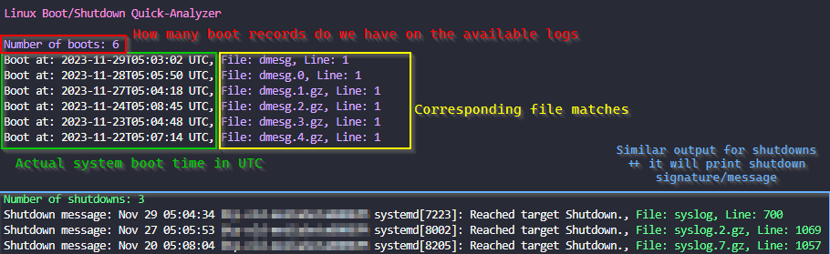



## Source
🔗 [samatild/linuxrebootcheck](https://github.com/samatild/linuxrebootcheck)


## What is Linux Boot/Shutdown Quick-Analyzer and why do you need it?

The Linux Boot/Shutdown Quick-Analyzer is a Python script that analyzes Linux boot and shutdown logs.



It makes it easy to find boot and shutdown events in system logs, providing information such as the number of boot and shutdown events, along with the timestamp, filename, and line number for each event.


## How to run it

1. You need to have Python 3 installed on your machine.

2. To use the script, navigate to the directory containing your logs (usually /var/log) and run the following command:

```bash
# Make sure you are working inside your system logs dir
cd /var/log

# Exucute the script
curl https://raw.githubusercontent.com/samatild/linuxrebootcheck/main/linuxrebootcheck.py | python3
```

### Special arguments for special Serial Console logs!
What about those logs that are not in the usual format?

To analyze Serial Console file, you need to download the script and use the --serial-console-log argument followed by the filename:
```bash
curl -O https://raw.githubusercontent.com/samatild/linuxrebootcheck/main/linuxrebootcheck.py
python3 linuxrebootcheck.py --serial-console-log <your_log_file>
```

## Conclusion
Overall, the Linux Boot/Shutdown Quick-Analyzer is a useful tool for analyzing Linux boot and shutdown logs. It provides a quick and easy way to find boot and shutdown events in system logs, making it easier to troubleshoot issues and identify potential problems. If you're looking for a simple and efficient way to analyze your system logs, give it a try!